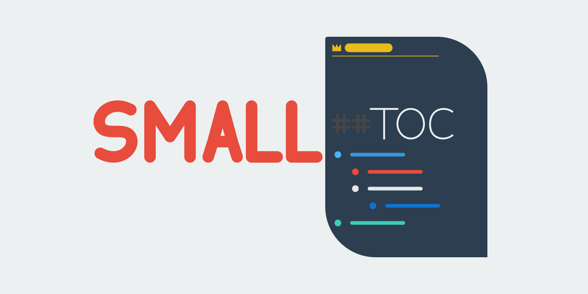

# SMALL TOC



A lightweight table-of-content generator for Markdown

## Table of content

- [About](#about)
    - [Short story](#short-story)
- [Installing](#installing)
- [Uninstalling](#uninstalling)
- [Usage](#usage)
    - [Getting help](#getting-help)

## About

Written in shell script, POSIX-compliant table of content (TOC for short) generator.

**NOTE:**
This page's TOC was also made by the script.

### Short story

I needed a TOC generator so I made one myself.  
**THE END**

## Installing

For now, the only way is cloning the repository to your local machine. I suggest doing that in the user's home directory.

Get the whole git tree
```sh
git clone https://github.com/Adamocho/smalltoc.git
```

Get the latest version (shallow clone)
```sh
git clone --depth 1 https://github.com/Adamocho/smalltoc.git
```

Now `cd` inside and install it using

> You may need execute permission.  
> For that use: `[sudo] chmod +x FILENAME`

```sh
./smalltoc.sh install
```
**OR**
```sh
./smalltoc.sh add
```
Those two are equivalent

## Uninstalling

Simply use `uninstall` or `remove`, which are, as before, equivalent

```sh
smalltoc uninstall #OR remove
```

## Usage

The usage is very straightforward

```sh
smalltoc FILE_1 FILE_2 FILE_3 # etc.
```

It will print the table of content in the terminal (for now)

### Getting help

Use it either without arguments or with `-h` | `--help`
